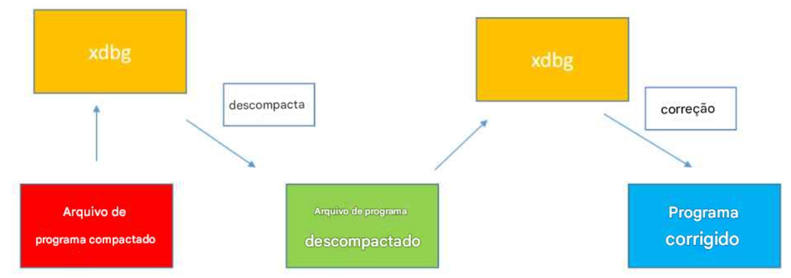
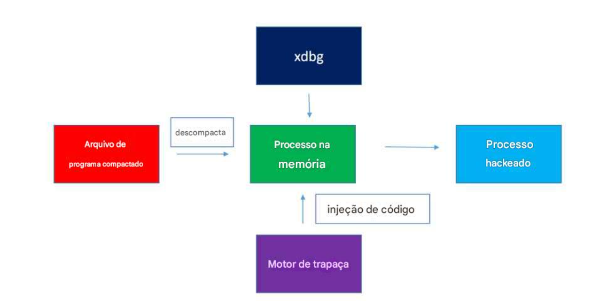

# **Engenharia Reversa e Manipulação de Memória**.

Repositorio com objetivo de ter habilidade de usar técnicas de hacking para memória de programas em execução no Windows e modificar seu comportamento.

Praticas e métodos apropriados, especialmente programados para o aprendizado de engenharia reversa.

Ir além de apenas modificar softwares, hacking de memória e tecnologias avançadas.

O conhecimento sobre hacking de memória ajudará a entender as vulnerabilidades da proteção de softwares e como melhorar a segurança dos programas.

Com objetivo de aprimora habilidades como:

- Hackear a memória de processos
- Desmontar (disassemble) programas em código assembly;
- Configurar **breakpoints** e depurar código passo a passo;
- Modificar o comportamento de programas;
- Injetar código, interromper e rastrear a execução;
- Escanear a memória em busca de dados importantes e instruções de privacidade;
- Escrever seus próprios **hackers de memória**, também conhecidos como **trainers**;
- Compreender as limitações e vulnerabilidades da proteção de software;
- Depurar e modificar programas protegidos
- Alterar o comportamento de programas
- Realizar injeção de código (também conhecida como Inline Assembly)
- Executar debugging com Break & Trace
- Escanear a memória em busca de dados importantes
- Reverter instruções e algoritmos
- Criar seus próprios memory hackers (também conhecidos como trainers)
- Empacotar e desembrulhar CrackMes usando ferramentas populares
- Reverter e desmontar pacotes de proteção
- Modificar o comportamento da memória
- Avaliar vulnerabilidades e desenvolver técnicas para proteger software

### Com objetivo de aprender **engenharia reversa**, incluindo:

- **Hackers de jogos** que querem explorar a modificação de programas no Windows;
- Qualquer pessoa interessada em aprender como alterar a memória de processos e modificar o comportamento de softwares;
- Estudantes que desejam entender como os programas funcionam para melhorá-los;
- Aqueles que querem saber como fortalecer a proteção de softwares.

### Pré-requisitos

Algum conhecimento básico de **Assembly** pode ser útil, mas não é obrigatório. 
O foco é aprender tudo o que precisa saber sobre manipulação de memória.

---

# **Hackeando diretamente na memória**.

Em vez de modificar o arquivo do programa, podemos alterar a memória em tempo de execução.

Essa abordagem é parecida com o funcionamento de loaders, que modificam a memória sem alterar o arquivo original.

Como funciona?

- Carregamos o programa normalmente
- Identificamos pontos-chave na memória
- Alteramos as instruções na RAM (não no arquivo físico)

Esse método permite ignorar proteções que impediriam a modificação direta do programa.

## Aplicação prática
Descobrimos um endereço de memória importante usando ferramentas de engenharia reversa.
Usamos o Cheat Engine para injetar código e modificar esse endereço.
Alteramos as instruções do programa diretamente na memória, sem modificar o arquivo original.
Por exemplo:

Tradicionalmente, descompactamos e depois corrigimos

Novo método, hackeamos a memória

Podemos modificar uma verificação de segurança, transformando um *JNE (Jump Not Equal)* em um *JMP (Jump Always)*.
Isso pode desbloquear funcionalidades ou remover restrições do software.

