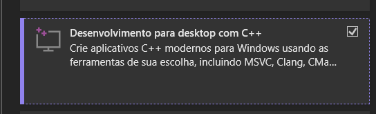
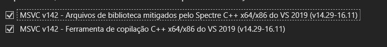
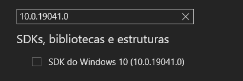

### **📌 O que é Ring 0 no Windows e em Sistemas Operacionais?**

Os sistemas operacionais modernos, como **Windows e Linux**, usam um **modelo de privilégio em anéis (rings)** para separar níveis de acesso ao hardware e proteger o sistema de falhas e ameaças.

Esse modelo é dividido em **quatro níveis principais de privilégio**, chamados de **Rings** (Anéis):

- **🔴 Ring 0 (Modo Kernel) → Acesso Total**
- **🟡 Ring 1 e Ring 2 → Pouco usados (somente em sistemas específicos)**
- **🟢 Ring 3 (Modo Usuário) → Aplicações comuns**

---

## **🛑 Ring 0 (Modo Kernel) – O Nível Mais Alto**
📌 **Ring 0** é o nível **mais privilegiado** de um sistema operacional. Ele permite **acesso direto ao hardware** e **controle total sobre o sistema**, incluindo:
✅ Acesso à **memória RAM** sem restrições  
✅ Controle de **processadores, drivers e dispositivos**  
✅ Permissão para **criar e encerrar processos**  
✅ Gerenciamento de **acesso a arquivos e rede**  

No Windows, **drivers de hardware e o núcleo do sistema (NT Kernel)** rodam em **Ring 0**.

📢 **IMPORTANTE:**  
- **Códigos que rodam em Ring 0 podem travar ou corromper o sistema se tiverem erros.**  
- **Se um driver de kernel falhar, o sistema pode apresentar "Tela Azul da Morte" (BSOD).**  

---

## **🟢 Ring 3 (Modo Usuário) – Onde Programas Comuns Rodam**
📌 **Ring 3** é o nível onde **programas normais** (como navegadores, jogos e editores de texto) rodam. Ele tem **restrições de acesso ao hardware e ao sistema** para evitar que um programa malicioso ou com bug comprometa o computador.

**Programas em Ring 3 NÃO PODEM:**
❌ Acessar diretamente a **memória RAM**  
❌ Controlar **dispositivos de hardware** (placa de vídeo, teclado, etc.)  
❌ Encerrar processos críticos do sistema  
❌ Interagir diretamente com **o kernel**  

Por isso, um programa comum **precisa chamar funções da API do sistema operacional (como a API do Windows)** para pedir permissões ao Kernel.

---

## **🟡 Ring 1 e Ring 2 – Usados em Sistemas Específicos**
Esses anéis intermediários **são pouco usados em sistemas modernos**. Em alguns sistemas operacionais antigos ou embutidos, Ring 1 e Ring 2 eram usados para tarefas como **drivers de dispositivos específicos**.

Hoje, a maioria dos sistemas apenas divide:
- **Ring 0 (Kernel)**
- **Ring 3 (Usuário)**

---

## **🛠 Exemplo Prático: Por que um Driver roda em Ring 0?**
Imagine que você quer **monitorar a criação de processos** (como no seu caso).  

- Se fizer isso **em Ring 3 (com C# e .NET)**, precisará usar APIs do Windows, como `Process.GetProcessesByName()`. Mas você terá **limitações** e não poderá ver **processos ocultos ou protegidos pelo sistema**.
  
- Se fizer isso **em Ring 0 (com um Driver de Kernel em C)**, poderá **ver todos os processos do sistema em tempo real**, até mesmo aqueles ocultos ou bloqueados por segurança.

---

## **🔍 Comparação entre Ring 0 e Ring 3**
| Característica | Ring 0 (Kernel) | Ring 3 (Usuário) |
|--------------|----------------|----------------|
| **Acesso ao hardware** | ✅ Sim | ❌ Não |
| **Pode travar o sistema?** | ⚠️ Sim (se houver bugs) | 🔒 Não (só trava o próprio programa) |
| **Executa código crítico do sistema?** | ✅ Sim | ❌ Não |
| **Precisa de permissões elevadas?** | ✅ Sim | ❌ Não |
| **Exemplo de código** | **Driver de Kernel (C, C++)** | **Programa comum (C#, Python, Java)** |

---

## **📌 Conclusão: Quando usar Ring 0?**
**Você deve usar Ring 0 APENAS quando:**
✅ Precisa de **acesso direto ao hardware**  
✅ Quer **monitorar ou manipular processos** do sistema  
✅ Precisa criar um **driver de hardware ou segurança**  
✅ Está desenvolvendo uma solução de **baixo nível, como antivírus ou firewall**  

Se seu objetivo for apenas **monitorar processos e interagir com o sistema de forma segura**, **Rodar em Ring 3 é suficiente!** Você pode usar **C# e APIs do Windows**.

---

# Configurar um ambiente de desenvolvimento para engenharia reversa, depuração e modificação de software no Windows

### **1. Links Importantes**
Os links uteis para ferramentas usadas para engenharia reversa e desenvolvimento:

- **Cheat Engine Source:** Repositório oficial do código-fonte do Cheat Engine no GitHub. O **Cheat Engine** é uma ferramenta para modificar valores da memória de processos em execução, frequentemente usada para "trapaças" em jogos.
- **Lazarus:** Um ambiente de desenvolvimento (IDE) para a linguagem **Pascal**, baseado no Free Pascal Compiler (FPC).
- **HxD:** Um editor hexadecimal que permite modificar diretamente os bytes de arquivos ou da memória do sistema.
- **Visual Studio 2019:** Um ambiente de desenvolvimento da Microsoft, necessário para compilar e depurar programas escritos em C++ e outras linguagens.
- **Windows SDK:** Um conjunto de bibliotecas e ferramentas para desenvolver e depurar aplicativos Windows.
- **WDK (Windows Driver Kit):** Ferramenta usada para desenvolver drivers para Windows.

---

### **2. Configuração do Visual Studio 2019**
Instalação do [**Visual Studio 2019**](https://my.visualstudio.com/Downloads?q=visual%20studio%202019&wt.mc_id=o~msft~vscom~older-downloads), com o **pacote de desenvolvimento para desktop com C++**. Ele especifica módulos necessários:



- **Ferramentas de compilação MSVC v142-VS2019:** O compilador **Microsoft Visual C++** na versão 142, para compilar código nativo C++.
- **Bibliotecas Spectre-mitigadas:** Versões das bibliotecas C++ que possuem proteções contra a vulnerabilidade **Spectre** (um tipo de ataque baseado em execução especulativa).

Além disso, inclui bibliotecas específicas para C++:
- **ATL (Active Template Library):** Usada para criar componentes COM e aplicativos leves no Windows.
- **MFC (Microsoft Foundation Classes):** Framework da Microsoft para criar aplicativos GUI baseados no Windows.

---
• Ferramentas de compilação MSVC v142-VS2019 C++ x64/x86 (mais recente)

• Bibliotecas MSVC v142-VS2019 C++ x64/x86 Spectre-mitigadas (mais recente) 



---

### **3. Instalação do Windows 10 SDK (versão 2004 - 10.0.19041.0)**
Este SDK contém ferramentas e bibliotecas para desenvolvimento de software no Windows 10.



Componentes destacados:
- **Windows Performance Toolkit:** Ferramenta para análise de desempenho do sistema e aplicativos.
- **Ferramentas de depuração para Windows:** Permite depurar aplicativos, drivers e até o próprio sistema operacional.
- **Kit de desenvolvimento .NET Framework 4.8:** Para desenvolver aplicativos baseados em .NET Framework.
- **Windows IP sobre USB:** Para comunicação entre dispositivos usando USB.
- **Ferramentas de assinatura:** Para assinar binários, garantindo autenticidade e integridade.

Algumas opções não foram selecionadas, como:
- **Kit de certificação de aplicativos do Windows:** Usado para verificar se um aplicativo está em conformidade com os padrões da Microsoft.
- **Ferramentas MSI:** Para trabalhar com pacotes de instalação MSI.

---

### **4. Instalação do WDK para Windows 10, versão 2004**
- O **WDK (Windows Driver Kit)** é necessário para desenvolver **drivers** para Windows.
- Também menciona a instalação da **extensão do Visual Studio para WDK**, permitindo desenvolver drivers diretamente no Visual Studio.

---

### **5. Script Lua**
O link para o **script Lua** no [Pastebin](https://pastebin.com/DtH9GGs6) seque o código disponível para ser utilizado no Cheat Engine ou outra ferramenta de automação.

```lua
local function obfuscateCaption(c)
  if not c.Caption then return end
 
  local homoglyphs = {
    ["a"] = "а",
    ["b"] = "Ь",
    ["c"] = "с",
    ["d"] = "ԁ",
    ["e"] = "е",
    ["f"] = "f",
    ["g"] = "ɡ",
    ["h"] = "һ",
    ["i"] = "і",
    ["j"] = "ј",
    ["k"] = "к",
    ["l"] = "ӏ",
    ["m"] = "m",
    ["n"] = "п",
    ["o"] = "о",
    ["p"] = "р",
    ["q"] = "ԛ",
    ["r"] = "г",
    ["s"] = "ѕ",
    ["t"] = "т",
    ["u"] = "ц",
    ["v"] = "ѵ",
    ["w"] = "w",
    ["x"] = "х",
    ["y"] = "у",
    ["z"] = "z",
    ["A"] = "А",
    ["B"] = "В",
    ["C"] = "С",
    ["D"] = "D",
    ["E"] = "Е",
    ["F"] = "Ϝ",
    ["G"] = "Ԍ",
    ["H"] = "Н",
    ["I"] = "І",
    ["J"] = "Ј",
    ["K"] = "К",
    ["L"] = "Լ",
    ["M"] = "М",
    ["N"] = "Ν",
    ["O"] = "О",
    ["P"] = "Р",
    ["Q"] = "Q",
    ["R"] = "R",
    ["S"] = "Ѕ",
    ["T"] = "Т",
    ["U"] = "U",
    ["V"] = "Ѵ",
    ["W"] = "W",
    ["X"] = "Х",
    ["Y"] = "Υ",
    ["Z"] = "Z"
  }
 
  local obfuscatedCaption = ""
  for i = 1, #c.Caption do
    local char = c.Caption:sub(i, i)
    obfuscatedCaption = obfuscatedCaption .. (homoglyphs[char] or char)
  end
 
  c.Caption = obfuscatedCaption
end
 
local function applyObfuscationToComponents(c)
  if c.Component then
    for i = 0, c.ComponentCount - 1 do
      applyObfuscationToComponents(c.Component[i])
    end
  end
 
  obfuscateCaption(c)
end
 
for i = 0, getFormCount() - 1 do
  local form = getForm(i)
  applyObfuscationToComponents(form)
end
 
registerFormAddNotification(function(f)
  f.registerCreateCallback(applyObfuscationToComponents)
end)
```

### **Explicação do Script**
Esse script Lua deve ser usado no **Cheat Engine** para modificar a exibição de textos na interface do usuário. Ele substitui caracteres comuns por **homoglifos** (caracteres visualmente semelhantes de outros alfabetos), tornando os textos mais difíceis de serem detectados ou reconhecidos automaticamente.

---

### **Funcionamento**
1. **Substituição por Homoglifos**
   - O script define uma tabela chamada `homoglyphs`, onde letras do alfabeto latino são mapeadas para caracteres visualmente similares de outros alfabetos (principalmente cirílico e grego).
   - Exemplo: A letra **"A"** é substituída por **"А"** (cirílico), "E" por "Е", "P" por "Р", etc.

2. **Função `obfuscateCaption(c)`**
   - Verifica se o componente (`c`) tem uma propriedade `Caption` (o texto visível do elemento da interface).
   - Percorre cada caractere do texto e substitui pelas versões homoglíficas definidas na tabela.
   - Atualiza a `Caption` do componente com a versão modificada.

3. **Função `applyObfuscationToComponents(c)`**
   - Verifica se o componente possui subcomponentes.
   - Aplica a obfuscação a cada subcomponente recursivamente.
   - Finalmente, obfusca a legenda (`Caption`) do próprio componente.

4. **Aplicação em todas as janelas do Cheat Engine**
   - O script percorre todas as janelas abertas (`getFormCount()` e `getForm(i)`) e aplica a função `applyObfuscationToComponents(form)` a cada uma delas.

5. **Registro de Notificação**
   - `registerFormAddNotification(function(f) ... )` adiciona um gancho que detecta quando um novo formulário é criado no Cheat Engine.
   - Quando um novo formulário aparece, ele aplica a obfuscação imediatamente.

---

### **Objetivo**
Esse script pode ser utilizado para:
- **Evadir detecção automática**: Alguns softwares podem tentar identificar o Cheat Engine com base em textos específicos na interface. Alterando esses textos para caracteres homoglíficos, a detecção por string matching pode ser dificultada.
- **Ocultar ou camuflar a interface**: Caso alguém esteja monitorando visualmente a interface, os textos continuarão legíveis para humanos, mas difíceis de copiar ou processar automaticamente.
- **Engenharia reversa e personalização**: Pode ser usado para modificar a UI do Cheat Engine de forma personalizada.

---

### **Conclusão**
Esse script está essencialmente **"disfarçando"** a interface do Cheat Engine ao substituir os textos por versões homoglíficas. Ele pode ser útil para evitar sistemas de detecção baseados em OCR ou busca de strings, enquanto mantém a interface legível para o usuário.


---

### **Resumo**
Esse conjunto de instruções é típico para configurar um ambiente de desenvolvimento usado para:
- **Desenvolver e compilar programas C++ no Windows**
- **Criar e depurar drivers**
- **Editar memória e engenharia reversa**
- **Utilizar o Cheat Engine para modificações em jogos ou aplicativos**
