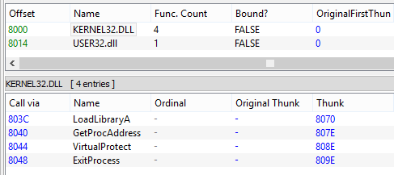
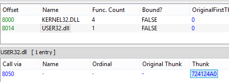
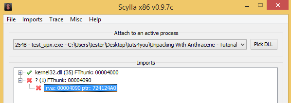
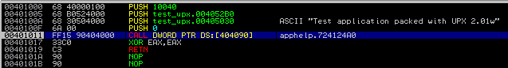
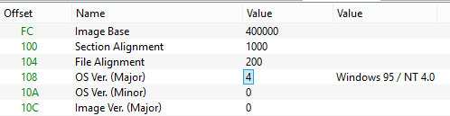
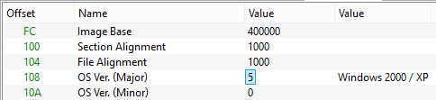

[Artigo original ](https://hshrzd.wordpress.com/2019/06/27/application-shimming-vs-import-table-recovery/)

-----

### **Shimming de aplicativos vs. recuperação da Tabela de Importação**

**Publicado em:** 27 de junho de 2019 **por:** hasherezade

-----

*Neste post, estou compartilhando um caso que investiguei recentemente, durante os testes do meu aplicativo, [PE-sieve](https://github.com/hasherezade/pe-sieve). Ele demonstra como os shims aplicados pelo sistema operacional podem atrapalhar a recuperação de Importações.*

### Recursos testados

Recentemente, lancei uma nova versão do PE-sieve. Um dos recursos adicionados foi a recuperação completa da Tabela de Importação. A partir de agora, se você executar o PE-sieve com a opção `/imp 3`, ele coletará todos os endereços que o módulo escaneado importou das DLLs na memória e construirá uma nova Tabela de Importação a partir deles. É um recurso muito útil que muitos dumpers de PE possuem. Ajuda, por exemplo, a lidar com aplicativos empacotados. Tomemos como exemplo o UPX: ele pode comprimir a Tabela de Importação do payload e carregá-la dinamicamente durante o desempacotamento.

O PE-sieve também oferece outro modo de recuperação, mais "suave" (`/imp 2`). Nesse caso, o PE-sieve se baseia na tabela de importação existente e apenas reconstrói os elementos apagados. Pode ser usado, por exemplo, no seguinte caso, quando os Thunks foram sobrescritos pelos endereços das funções durante o carregamento das importações:

O PE-sieve é capaz de reconhecer as exportações que estão nesses endereços e preenche seus nomes de volta na tabela:

### Casos de teste

Decidi testar meu aplicativo em alguns exemplos prontos и bem conhecidos. Selecionei a série de desempacotamento do Anthracene, disponível [aqui](https://tuts4you.com/download/158/).

A primeira amostra (1dbfd12ad3ee39930578b949c6899d0a) parece bastante direta. É um aplicativo simples que mostra uma MessageBox, empacotado com a ajuda do UPX.

### Peculiaridade

Executei este exemplo em uma das minhas Máquinas Virtuais (Windows 8 de 64 bits) e as importações foram recuperadas sem falhas ([vídeo](https://youtu.be/eTt3QU0F7V0?t=369)).

Mais tarde, tentei fazer o mesmo em uma máquina diferente, com outro conjunto de patches instalado. Por algum motivo, não consegui reproduzir os resultados válidos. A recuperação de importações "magicamente" parou de funcionar – os resultados recebidos estavam incompletos. Quando tentei extrair o payload com o PE-sieve, usando a opção `/imp 2`, todas as funções importadas da Kernel32.dll foram recuperadas, mas a função da User32: MessageBoxA não foi.

Primeiro, presumi que devia ser um bug no PE-sieve, mas descobri que outros aplicativos, como o Scylla, tinham o mesmo problema: eles não conseguiam mapear esse endereço para nenhuma das funções exportadas.

Investiguei o endereço mencionado no depurador, e foi isso que vi. A chamada para MessageBoxA estava sendo intermediada (proxied) via `apphelp`:

A função usada do `apphelp` não estava presente na tabela de exportação, então é lógico que os aplicativos que recuperam importações não pudessem reconhecê-la. Portanto, não é realmente um bug no aplicativo – mas um problema causado por alguma maneira peculiar pela qual essa importação foi carregada.

### Explicação

Claro que eu queria entender qual era a razão de tal comportamento. Suspeitei que deveria haver algum [shimming](https://en.wikipedia.org/wiki/Shim_\(computing\)) acontecendo, mas por que isso aconteceu? Verifiquei outros aplicativos que importavam MessageBoxA, mas cada um deles usava essa função diretamente da User32.dll, e a apphelp.dll não era usada como proxy.

Comecei a pensar que poderia estar relacionado ao fato de que meu caso de teste é um aplicativo muito antigo.

A Versão do SO no cabeçalho PE está definida como 4 (Win 95):

Fiz um experimento e o "atualizei", apenas mudando o número da versão:

E funcionou\! Após essa simples mudança, o shim não foi mais aplicado. O aplicativo usou a importação diretamente e, como resultado, o PE-sieve (e outros aplicativos) conseguiram reconhecer a função adequadamente.

Então, descobri que o sistema operacional aplica esse shim automaticamente para compatibilidade retroativa com aplicativos antigos.

Agora que penso nisso, parece bastante óbvio, mas não foi tão intuitivo quando vi pela primeira vez, por isso decidi documentar este caso. Portanto, apenas um pequeno aviso: quando a recuperação de importações não estiver indo bem, primeiro verifique se os shims não são o motivo\! Espero que tenham gostado do meu pequeno artigo.