[Atigo original ](https://hshrzd.wordpress.com/2025/03/22/unpacking-executables-with-tinytracer-pe-sieve/?utm_source=chatgpt.com)
-----

### **Tutorial: Desempacotando executáveis com TinyTracer + PE-sieve**

**Publicado em:** 22 de março de 2025 **por:** hasherezade

-----

*Abrange: localização automática de OEP, reconstrução de IAT, como evitar antidebugs e corrigir importações quebradas por shims.*

Neste breve blog, gostaria de demonstrar como desempacotar um executável com o [PE-sieve](https://github.com/hasherezade/pe-sieve/) e o [Tiny Tracer](https://github.com/hasherezade/tiny_tracer/). Como exemplo, vamos usar o executável que foi empacotado com uma versão modificada do UPX:

  * [8f661f16c87169fefc4dc7e612521ad8498c016a0153c51dae67af0b984adaac](https://malshare.com/sample.php?action=detail&hash=8f661f16c87169fefc4dc7e612521ad8498c016a0153c51dae67af0b984adaac)

Normalmente, ao lidar com casos empacotados com UPX, podemos usar o [executável original do UPX](https://upx.github.io/) para desempacotá-lo. Mas, como esta é uma versão modificada, não foi possível:

```
./upx -d ~/packed.exe
               Ultimate Packer for eXecutables
                          Copyright (C) 1996 - 2020
UPX 3.96        Markus Oberhumer, Laszlo Molnar & John Reiser   Jan 23rd 2020

       File size         Ratio      Format      Name
   --------------------   ------   -----------   -----------
upx: /home/tester/packed.exe: CantUnpackException: file is modified/hacked/protected; take care!!!

Unpacked 0 files.
```

A maneira mais conhecida de lidar com esses casos é usando o [x64dbg](https://x64dbg.com/) e o [Scylla](https://github.com/NtQuery/Scylla). O caminho clássico foi descrito há muitos anos na [série de tutoriais “Unpacking with Antracene”](https://forum.tuts4you.com/files/file/2040-unpacking-with-anthracene/) [1]. Este método requer a abertura do executável principal no depurador, a definição de pontos de interrupção apropriados e o acompanhamento da execução até atingir o **Ponto de Entrada Original (OEP)**. Depois de encontrarmos o OEP, extraímos a versão desempacotada do PE da memória e, em seguida, corrigimos o dump pesquisando e reconstruindo a IAT. Os detalhes de quais pontos de interrupção definir e como a execução deve ser seguida dependem do empacotador específico. Em alguns casos, o stub pode conter algumas medidas anti-depuração que precisam ser derrotadas adicionalmente.

Aqui, demonstrarei como um efeito semelhante pode ser alcançado com a ajuda das minhas ferramentas. Essa maneira alternativa é mais genérica e não depende dos detalhes da implementação do stub. Também podemos evitar o uso de um depurador e não nos preocuparmos com quaisquer inconvenientes adicionais criados por técnicas de evasão. Para fins de extração, usamos o [PE-sieve com o argumento `/imp`](https://github.com/hasherezade/pe-sieve/wiki/4.3.-Import-table-reconstruction-(imp)) Reconstrução da tabela de importação , que encontra automaticamente a nova IAT e reconstrói a tabela de importação.

Para manter esta demonstração simples, escolhi um exemplo de um UPX personalizado. Mas este método de desempacotamento pode funcionar bem para uma variedade de empacotadores: desde que estejamos lidando com o tipo clássico, que envolve o uso de um único stub de desempacotamento. Ele não produzirá resultados completos e executáveis quando forem aplicados empacotadores que usam virtualização (ou seja, [VMProtect](https://vmpsoft.com/vmprotect/overview/), Themida, etc.) - ainda assim, mesmo nesses casos, pode nos ajudar a obter um material útil para análise estática.

-----

### **Ferramentas Utilizadas**

  * [PE-bear](https://github.com/hasherezade/pe-bear) – para visão geral e modificação de PE
  * [TinyTracer](https://github.com/hasherezade/tiny_tracer) – para rastreamento
  * [HollowsHunter](https://github.com/hasherezade/hollows_hunter) (ou [PE-sieve](https://github.com/hasherezade/pe-sieve)) – para extração e reconstrução da Tabela de Importação

-----

### **Visão Geral da Amostra (PE-bear)**

Vamos começar abrindo a amostra no [PE-bear](https://github.com/hasherezade/pe-bear/), para ter uma breve visão geral.

A primeira coisa que se destaca é que nosso PE possui seções com nomes atípicos. Existem duas seções criadas pelo empacotador: “0000” e “1111”. A execução começa na segunda, “1111”. Portanto, podemos suspeitar que é aqui que o stub de desempacotamento está localizado.

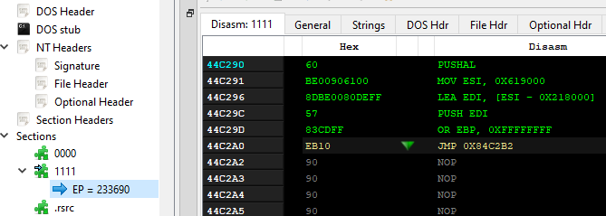

A primeira seção, “0000”, tem as características de executável definidas, mas está vazia no arquivo (observe o `Raw size: 0`). Podemos prever que é aqui que o código original será preenchido.
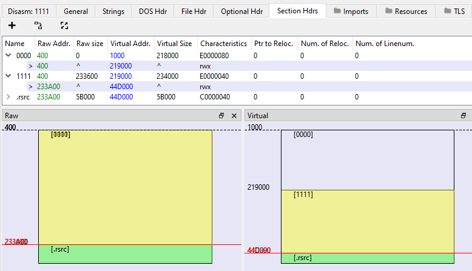
Passando a observar diferentes cabeçalhos, podemos ver que a amostra foi compilada para uma versão antiga do Windows: XP.

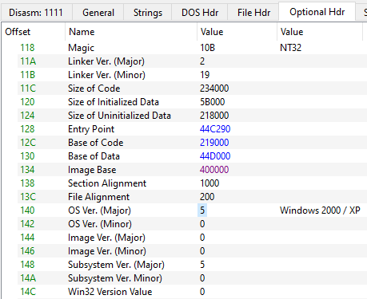

Isso pode causar alguns problemas mais adiante no processo de desempacotamento. Muitas vezes, no Windows moderno, os executáveis compilados para versões antigas são executados com [shims de compatibilidade](https://techcommunity.microsoft.com/blog/askperf/demystifying-shims---or---using-the-app-compat-toolkit-to-make-your-old-stuff-wo/374947) aplicados. Isso pode corromper o processo de extração de importações (veja mais detalhes [aqui](https://hshrzd.wordpress.com/2019/06/27/application-shimming-vs-import-table-recovery/)).

-----

### **Executando a Amostra via Pin (TinyTracer)**

Primeiro, executaremos nossa amostra sob o controle da plataforma de Instrumentação Binária Dinâmica, [Intel PIN](https://www.intel.com/content/www/us/en/developer/articles/tool/pin-a-dynamic-binary-instrumentation-tool.html). Como ferramenta de rastreamento, usaremos o [TinyTracer](https://github.com/hasherezade/tiny_tracer/). Você pode encontrar as [instruções detalhadas de instalação na Wiki](https://github.com/hasherezade/tiny_tracer/wiki/Installation).

Executar uma amostra via TinyTracer oferece vários benefícios:

  * Ele produz um log de rastreamento (tracelog) que pode nos ajudar a identificar o Ponto de Entrada Original da amostra muito rapidamente.
  * O Intel PIN não é um depurador, portanto, não será afetado pela maioria das verificações anti-depuração que o stub do empacotador possa conter (uma boa explicação é fornecida [aqui](https://youtu.be/1-q7LaNhGVM?t=768)). Além disso, o TinyTracer permite [contornar várias verificações AntiVm e AntiDebug](https://github.com/hasherezade/tiny_tracer/wiki/The-INI-file#antidebug).
  * Ao rastrear um executável via Pin, podemos verificar facilmente se alguma das APIs é executada com os shims de compatibilidade aplicados. Isso nos ajuda a evitar os problemas com a extração da tabela de importação, que foram mencionados anteriormente ([os shims podem interferir, dificultando a reconstrução](https://hshrzd.wordpress.com/2019/06/27/application-shimming-vs-import-table-recovery/)).
  * Ele nos permite pausar a execução em um determinado deslocamento (offset) (sem a necessidade de definir um ponto de interrupção em um depurador).

Então, vamos começar rastreando o executável com o Tiny Tracer (o log de rastreamento completo produzido está disponível [aqui](https://gist.github.com/hasherezade/eb09bd747208c2aee9b281d5ed6e66b2)).

#### **Prevenindo os shims de compatibilidade**

Com um log de rastreamento completo, podemos primeiro ver se alguma das funções foi chamada por meio de [shims de compatibilidade](https://reactos.org/wiki/User:Learn_more/Appcompat). Podemos reconhecê-los como as chamadas feitas através do módulo `apphelp`. Por exemplo, este fragmento do log de rastreamento contém shims:

```
[...]
1307c;apphelp.[SE_GetProcAddressForCaller+710]*
12cb4;apphelp.[SdbGetNthUserSdb+2e0]*
132f4;apphelp.[SE_GetProcAddressForCaller+620]*
1307c;apphelp.[SE_GetProcAddressForCaller+710]*
12cb4;apphelp.[SdbGetNthUserSdb+2e0]*
132f4;apphelp.[SE_GetProcAddressForCaller+620]*
12bfc;apphelp.[SdbFindNextStringIndexedTag+4d0]*
```

Podemos tentar evitar isso alterando a Versão do SO no Cabeçalho Opcional, conforme descrito no [blog relacionado](https://hshrzd.wordpress.com/2019/06/27/application-shimming-vs-import-table-recovery/). No caso do aplicativo atualmente analisado, mudei o SO para Windows 10 (0xA):

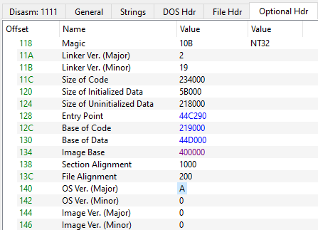

Podemos ver que o desvio foi bem-sucedido quando as funções chamadas nos mesmos deslocamentos (offsets) são finalmente referenciadas por suas DLLs originais:

```
[...]
1307c;user32.GetDC
12cb4;gdi32.GetDeviceCaps
132f4;user32.ReleaseDC
1307c;user32.GetDC
12cb4;gdi32.GetDeviceCaps
132f4;user32.ReleaseDC
12bfc;gdi32.CreatePalette
```

Se tivermos azar, podemos encontrar uma amostra que não será carregada corretamente sem os shims de compatibilidade e, para contorná-los, somos forçados a executá-la na versão dedicada do Windows e fazer a extração a partir daí.

#### **Identificando o Ponto de Entrada Original (OEP)**

Como sabemos, para desempacotar o aplicativo, precisamos encontrar seu OEP (esse conceito foi descrito muitas vezes em tutoriais clássicos, ou seja, [1]). É o melhor ponto para extrair o aplicativo. O stub de desempacotamento terminou sua execução e o código original está pronto na memória, mas ainda não foi executado. Localizar o OEP é muito fácil quando temos um log de rastreamento.

O que concluímos da visão geral é que a seção “0000” é onde o código original será descompactado. Portanto, o primeiro endereço nesta seção que for atingido será nosso Ponto de Entrada Original.

Procurar as transições entre a seção do stub e a seção de código recém-desempacotada é uma regra geral que podemos aplicar para o tipo clássico de empacotadores. No caso de empacotadores mais complexos, pode haver vários saltos de ida e volta entre as seções. Geralmente, devemos nos concentrar no último. Para ter certeza extra de que estamos no ponto em que o código original foi desempacotado, também podemos procurar outros padrões no log de rastreamento. É muito comum que a Tabela de Importação do aplicativo empacotado também seja compactada ou destruída de outra forma, e precise ser carregada manualmente na memória pelo stub de desempacotamento. Portanto, quando vemos no log muitas chamadas das funções de carregamento de importação (`LoadLibrary` + `GetProcAddress` ou seus equivalentes de baixo nível), é aí que essas preparações acontecem.

Fragmento do log de rastreamento:

```
[...]
44c3e7;kernel32.GetProcAddress
GetProcAddress:
    Arg[0] = ptr 0x72980000 -> {MZ\x90\x00\x03\x00\x00\x00}
    Arg[1] = ptr 0x0084b15b -> "ClosePrinter"

44c3d2;kernel32.LoadLibraryA
LoadLibraryA:
    Arg[0] = ptr 0x008a7ed4 -> "winspool.drv"

44c3e7;kernel32.GetProcAddress
GetProcAddress:
    Arg[0] = ptr 0x72980000 -> {MZ\x90\x00\x03\x00\x00\x00}
    Arg[1] = ptr 0x0084b172 -> "GetDefaultPrinterW"

44c415;kernel32.VirtualProtect
44c42a;kernel32.VirtualProtect
44c43b;[1111] -> [0000]
1d14b0;section: [0000]
e538;kernel32.GetModuleHandleW
4d84;kernel32.SetThreadLocale
```

Vendo este log de rastreamento, especialmente a transição de seções em:

```
44c43b;[1111] -> [0000]
1d14b0;section: [0000]
```

  - podemos concluir com alta confiança que o OEP está no **RVA = 0x1d14b0** (o primeiro endereço na seção recém-desempacotada, “0000”, que foi atingido). Portanto, é aqui que precisamos definir um ponto de interrupção (ou um [pseudo-ponto de interrupção no caso do TinyTracer](https://github.com/hasherezade/tiny_tracer/wiki/Stop-offsets)) para extrair um binário válido e desempacotado.

#### **Definindo o deslocamento de parada**

Com o Ponto de Entrada Original anotado da primeira sessão de rastreamento, podemos executar a amostra mais uma vez, desta vez pausando neste ponto específico, para que possamos extrair a amostra desempacotada.

Para pausar a execução no deslocamento (offset), podemos usar um depurador clássico, como o [x64dbg](https://x64dbg.com/). Mas, em alguns casos, o stub pode estar repleto de técnicas anti-depuração, que causarão problemas adicionais e, por exemplo, farão com que a amostra saia prematuramente.

Esses problemas não ocorrerão ao executar a amostra através do rastreador PIN, uma vez que o PIN não é um depurador e não pode ser detectado da mesma forma. Mas o PIN não permite a definição de pontos de interrupção... Ainda assim, podemos emular o comportamento do ponto de interrupção. No TinyTracer, existe a possibilidade de definir deslocamentos de parada (stop offsets). Os detalhes são descritos na [Wiki do TinyTracer [aqui]](https://github.com/hasherezade/tiny_tracer/wiki/Stop-offsets).

Nós apenas anotamos o RVA de parada no arquivo `stop_offsets.txt` no diretório de instalação do TinyTracer. Por padrão, a execução será pausada no deslocamento definido por 30 segundos. Se não for o suficiente para extrair a amostra, podemos aumentar esse tempo alterando as configurações relevantes no [TinyTracer.ini](https://github.com/hasherezade/tiny_tracer/wiki/The-INI-file). Quando a execução for pausada, veremos uma informação sobre isso no log de rastreamento (podemos visualizá-lo em tempo real usando a ferramenta [baretail](https://www.baremetalsoft.com/baretail/)).

-----

### **Extraindo a Amostra (com PE-sieve/HollowsHunter)**

Para esta parte, vamos usar o wrapper do PE-sieve, o [HollowsHunter](https://github.com/hasherezade/hollows_hunter). Ele possui [todos os recursos do PE-sieve](https://github.com/hasherezade/pe-sieve/wiki), além de outros adicionais, ou seja, permite escanear o processo selecionado pelo nome (não apenas pelo PID).

Existem [algumas diferenças sutis](https://github.com/hasherezade/pe-sieve/wiki/1.-FAQ#pe-sieve-vs-hollowshunter---what-is-the-difference) entre as opções padrão que são definidas em ambos. Por exemplo, por padrão, o PE-sieve varre em busca de hooks e patches nos módulos carregados, enquanto com o HollowsHunter você precisa solicitá-lo manualmente, usando o argumento `/hooks`. No caso atualmente analisado, estamos lidando com um executável empacotado, que sobrescreve uma de suas seções e a preenche com um novo conteúdo, portanto, é uma forma de correção de binário (binary patching). É por isso que, para que seja detectado pela varredura, temos que habilitar a opção “hooks” no Hollows Hunter.

Outra opção importante que deve ser definida é a [reconstrução de importação (ativada com `/imp`)]([https://github.com/hasherezade/pe-sieve/wiki/4.3.-Import-table-reconstruction-(imp](https://github.com/hasherezade/pe-sieve/wiki/4.3.-Import-table-reconstruction-\(imp\))). O modo automático de recuperação de importação, ativado por `/imp A`, será suficiente.

A linha de comando completa necessária para fazer a extração:

```
hollows_hunter.exe /pname packed.exe /hooks /imp A
```

A única coisa que precisamos garantir é que a extração foi feita no momento exato em que o Pin Tracer pausou no Ponto de Entrada Original.

Ao executar a amostra via Tiny Tracer e observar o log de rastreamento via Baretail, devemos ver a seguinte entrada:

```
1d14b0;section: [0000]
# Stop offset reached: RVA = 0x1d14b0. Sleeping 60 s.
```

Este é o momento de escanear o processo com o Hollows Hunter. Devemos ter a extração salva no diretório dedicado.

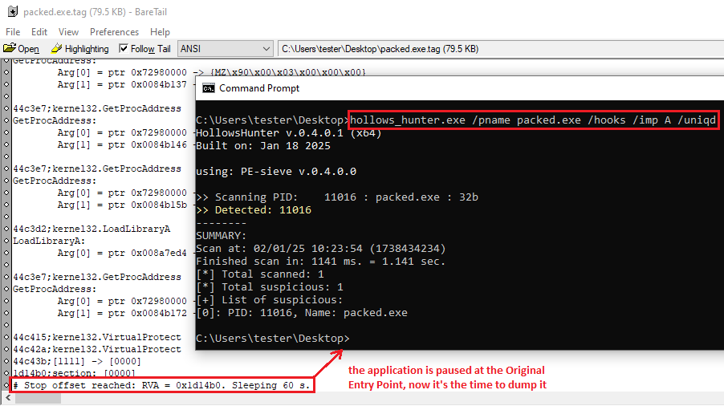

-----

### **Ajustes Finais – Alterando o Ponto de Entrada (com PE-bear)**

Embora o binário desempacotado seja extraído, ainda precisamos pós-processá-lo um pouco antes que ele se torne executável.

**A fazer:**

  * Alterar o Ponto de Entrada
  * Alterar as características das seções

Em primeiro lugar, o binário extraído ainda tem o Ponto de Entrada anterior salvo em seus cabeçalhos - levando ao stub, em vez da seção desempacotada. Podemos alterá-lo rapidamente apenas abrindo o executável extraído com o PE-bear e editando o valor no Cabeçalho Opcional:

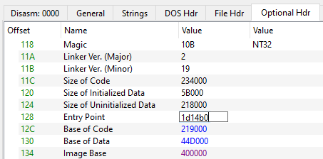

Uma maneira alternativa de fazer isso é pulando para esse RVA:

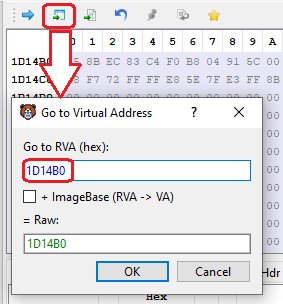

Então, na visão de desmontagem (disasm), podemos selecioná-lo como um novo Ponto de Entrada.

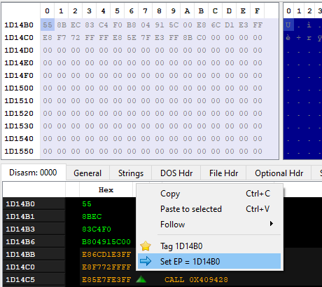

No entanto, se salvarmos o executável modificado e tentarmos executá-lo, encontraremos um erro:

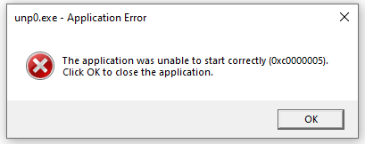

A razão pode ser adivinhada se olharmos novamente para as características das seções da extração:

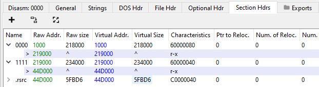

Como podemos ver, eles foram modificados na memória. No executável original, cada uma das seções tinha a característica **rwx** (leitura, escrita e execução). Podemos copiar essas características da amostra inicial e alterá-las de volta em nosso executável extraído.


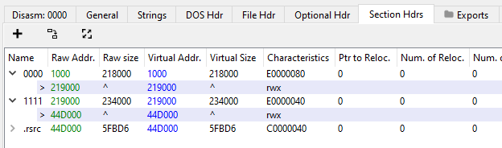

Depois desses poucos ajustes, tudo funciona bem, e podemos finalmente aproveitar nosso executável desempacotado\!

-----

### **Referências**

[1] [“Unpacking with Anthracene”](https://forum.tuts4you.com/files/file/2040-unpacking-with-anthracene/)

espelho: [Unpacking With Anthracene.zip](https://drive.google.com/file/d/13Bnw0AvIsJmezuJl31EhGmzNZYDitErw/view?usp=sharing), senha: `tuts4you`