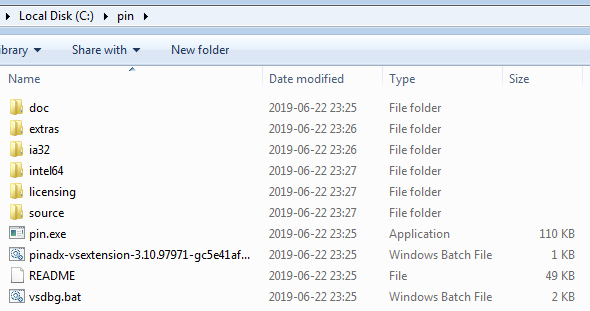
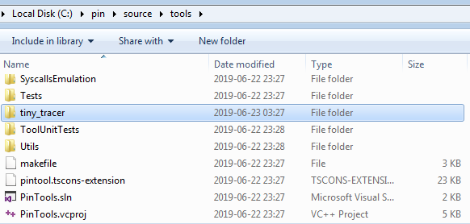
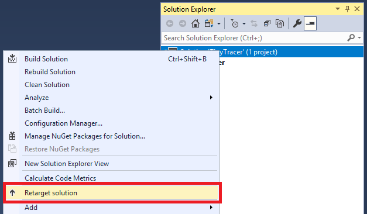
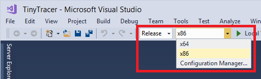
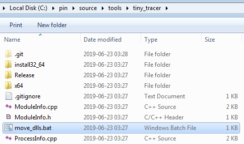
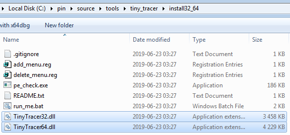

[Link atualizado](https://github.com/hasherezade/tiny_tracer/wiki/Installation)
-----

# Pré-requisitos

O Tiny Tracer é uma ferramenta PIN, o que significa que para executá-lo você precisa da plataforma Intel PIN.

O Intel PIN está disponível gratuitamente [aqui](https://software.intel.com/en-us/articles/pin-a-binary-instrumentation-tool-downloads). A licença do PIN не permite a distribuição das ferramentas em formato compilado, por isso você precisa compilá-las a partir do código-fonte.

-----

# No Windows

Para compilar o Tiny Tracer, você precisa de:

  - [Pin](https://software.intel.com/en-us/articles/pin-a-binary-instrumentation-tool-downloads): uma versão relevante para a versão específica (a última testada foi a 3.31, MSVC)
      - Se você precisar usar o Pin \>= 3.26, use [`TinyTracer.vcxproj`](https://www.google.com/search?q=%5Bhttps://github.com/hasherezade/tiny_tracer/blob/master/TinyTracer.vcxproj%5D\(https://github.com/hasherezade/tiny_tracer/blob/master/TinyTracer.vcxproj\)) - padrão
      - Se você precisar usar o Pin \< 3.26, use [`TinyTracer_Pin3.25.vcxproj`](https://www.google.com/search?q=%5Bhttps://github.com/hasherezade/tiny_tracer/blob/master/TinyTracer_Pin3.25.vcxproj%5D\(https://github.com/hasherezade/tiny_tracer/blob/master/TinyTracer_Pin3.25.vcxproj\)) - funciona para Pin: 3.19 - 3.25
      - Se você precisar usar o Pin \< 3.19, use [`TinyTracer_Pin3.18.vcxproj`](https://www.google.com/search?q=%5Bhttps://github.com/hasherezade/tiny_tracer/blob/master/TinyTracer_Pin3.18.vcxproj%5D\(https://github.com/hasherezade/tiny_tracer/blob/master/TinyTracer_Pin3.18.vcxproj\)) - funciona para Pin: 3.16 - 3.18
  - [Visual Studio](https://visualstudio.microsoft.com/downloads/): no mínimo 2012

*NOTA: Desde a versão 3.20, o Pin deixou de suportar versões antigas do Windows. Se você precisar usar a ferramenta em um Windows inferior ao 8, tente compilá-la com o Pin 3.19 (ou inferior).*

*Se tiver algum problema para construir o projeto, você pode usar as compilações de teste do [servidor AppVeyor](https://ci.appveyor.com/project/hasherezade/tiny-tracer). Selecione a plataforma e, em seguida, 'Artifacts'. Verifique a saída do 'Console' para ver qual versão do Pin é necessária para usá-las.*

## Como compilar

Depois de baixar a plataforma PIN, você precisa descompactá-la no seu diretório de destino. O caminho recomendado é `C:\pin`:



Você pode usar qualquer caminho de sua escolha, apenas lembre-se que isso exigirá um trabalho adicional de edição de alguns caminhos durante a instalação.

Com o seu PIN descompactado, você precisa clonar/copiar o código-fonte do Tiny Tracer para `\source\tools`. Para que a configuração padrão funcione, o diretório raiz do TinyTracer deve ser: `tiny_tracer`.



Agora abra o `TinyTracer.vcxproj` no Visual Studio. Para fins de compatibilidade retroativa, o projeto está direcionado para o Visual Studio 2012, mas você pode facilmente redirecioná-lo para qualquer versão mais recente. Para fazer isso, clique com o botão direito na solução e escolha `Retarget solution` no menu.



Compile 2 versões da `TinyTracer.dll`: 32 e 64 bits em modo `Release`.



Após compilar o código-fonte, você pode usar um script em lote: [`move_dlls.bat`](https://www.google.com/search?q=%5Bhttps://github.com/hasherezade/tiny_tracer/blob/master/move_dlls.bat%5D\(https://github.com/hasherezade/tiny_tracer/blob/master/move_dlls.bat\)):



O script moverá ambas as versões da DLL compilada para o diretório de instalação com os nomes desejados: `TinyTracer32.dll` e `TinyTracer64.dll`.



## Como instalar

O TinyTracer pode ser adicionado ao menu de contexto, para que você possa rastrear convenientemente qualquer executável de sua escolha. Se sua plataforma PIN estiver em `C:\pin`, você não precisa fazer nenhuma alteração nos scripts.

Vá para o diretório `install32_64`, onde o kit de ferramentas de instalação está localizado.

Se você já tinha o TinyTracer instalado, certifique-se de remover a instalação anterior executando [`delete_menu.reg`](https://www.google.com/search?q=%5Bhttps://github.com/hasherezade/tiny_tracer/blob/master/install32_64/delete_menu.reg%5D\(https://github.com/hasherezade/tiny_tracer/blob/master/install32_64/delete_menu.reg\)) antes de continuar.

Em seguida, leia o [`README.txt`](https://www.google.com/search?q=%5Bhttps://github.com/hasherezade/tiny_tracer/blob/master/install32_64/README.txt%5D\(https://github.com/hasherezade/tiny_tracer/blob/master/install32_64/README.txt\)), para confirmar que todos os caminhos estão definidos corretamente. Se tudo estiver OK, você pode executar o [`add_menu.reg`](https://www.google.com/search?q=%5Bhttps://github.com/hasherezade/tiny_tracer/blob/master/install32_64/add_menu.reg%5D\(https://github.com/hasherezade/tiny_tracer/blob/master/install32_64/add_menu.reg\)) para adicionar seu rastreador PIN ao menu de contexto.

Como resultado, você deve ver a opção adicional `Run with PIN (Tiny Tracer)`:

### Demonstração

Se a configuração estiver correta, executar o executável com o PIN causará uma informação semelhante a esta:

Conforme a execução progride, o log será salvo em um arquivo com a extensão `.tag`.

Para visualizar o log em tempo real, recomendo o [Baretail](https://www.baremetalsoft.com/baretail/).

Você pode ativar/desativar recursos editando o [`TinyTracer.ini`](https://www.google.com/search?q=%5Bhttps://github.com/hasherezade/tiny_tracer/wiki/The-INI-file%5D\(https://github.com/hasherezade/tiny_tracer/wiki/The-INI-file\)) e o [`parameters.txt`](https://www.google.com/search?q=%5Bhttps://github.com/hasherezade/tiny_tracer/wiki/Tracing-parameters-of-functions%5D\(https://github.com/hasherezade/tiny_tracer/wiki/Tracing-parameters-of-functions\)), localizados no diretório `install32_64`.

## Anexar a um processo existente

Executar o aplicativo via Pin é possível com a ajuda do menu instalado. No entanto, às vezes podemos precisar anexar a um aplicativo já em execução. Isso pode ser feito com a ajuda do script [`pin_attach.bat`](https://www.google.com/search?q=%5Bhttps://github.com/hasherezade/tiny_tracer/blob/master/install32_64/pin_attach.bat%5D\(https://github.com/hasherezade/tiny_tracer/blob/master/install32_64/pin_attach.bat\)).

O script deve ser executado a partir da linha de comando, fornecendo dois parâmetros:

  - o caminho para o módulo (dentro do processo) que queremos rastrear
  - o PID do alvo

Exemplo:

```cmd
C:\pin\source\tools\tiny_tracer\install32_64>pin_attach.bat "C:\Users\tester\Desktop\test_app.exe" 8924
```

-----

# No Linux

Para compilar o Tiny Tracer, você precisa de:

  - [Pin](https://software.intel.com/en-us/articles/pin-a-binary-instrumentation-tool-downloads): uma versão relevante para a versão específica (a última testada foi a 3.31)
  - `g++`, `make`

## Como compilar

Depois de baixar a plataforma PIN, você precisa descompactá-la no seu diretório de destino. O caminho recomendado é `$HOME/pin`.

```bash
cd $HOME/pin
~/pin$ ls
doc  extras  ia32  intel64  licensing  pin  pin.sig  README  source
```

Com o seu PIN descompactado, você precisa clonar/copiar o código-fonte do Tiny Tracer para `/source/tools`. Para que a configuração padrão funcione, o diretório raiz do TinyTracer deve ser: `tiny_tracer`.

```bash
~/pin/source/tools/tiny_tracer$ ls
FuncWatch.cpp  makefile.rules  move_dlls.bat     Settings.cpp            TinyTracer.vcxproj  Util.h
FuncWatch.h    make_linux.sh   ProcessInfo.cpp   Settings.h              TraceLog.cpp
install32_64   ModuleInfo.cpp  ProcessInfo.h     TinyTracer.cpp          TraceLog.h
makefile       ModuleInfo.h    README.md         TinyTracer.old.vcxproj  Util.cpp
```

Para construir automaticamente as versões de 32 e 64 bits e colocá-las no diretório necessário (`install32_64`), você pode usar o script [`make_linux.sh`](https://www.google.com/search?q=%5Bhttps://github.com/hasherezade/tiny_tracer/blob/master/make_linux.sh%5D\(https://github.com/hasherezade/tiny_tracer/blob/master/make_linux.sh\)):

```bash
~/pin/source/tools/tiny_tracer$ ./make_linux.sh 
```

Se a compilação for bem-sucedida, dois diretórios de saída terão sido criados: `obj-intel64` e `obj-ia32`. Cada um deles deve conter `TinyTracer.so`. O script copiará automaticamente cada versão do TinyTracer para o diretório `install32_64`, com os nomes, respectivamente, `TinyTracer32.so` e `TinyTracer64.so`.

Se tudo correu bem, o script terminará sua execução imprimindo:

```bash
[+] 64 bit build ok.
[+] 64 bit install ok.
[+] 32 bit build ok.
[+] 32 bit install ok.
```

## Como instalar

Assumindo que você construiu o TinyTracer com `make_linux.sh` e tem ambos os componentes no lugar, agora você pode rastrear aplicativos usando [`tiny_runner.sh`](https://www.google.com/search?q=%5Bhttps://github.com/hasherezade/tiny_tracer/blob/master/install32_64/tiny_runner.sh%5D\(https://github.com/hasherezade/tiny_tracer/blob/master/install32_64/tiny_runner.sh\)). Se você não alterou o caminho recomendado, este script não requer nenhuma modificação. Caso contrário, você precisa editar os caminhos dentro do script de acordo.

O script contém caminhos absolutos para todos os componentes, então ele pode ser copiado para qualquer diretório de sua escolha.

Para tornar o rastreamento com PIN disponível de qualquer diretório (sem a necessidade de copiar o script), você pode adicionar um link simbólico ao seu diretório `bin` local:

```bash
ln -s $HOME/pin/source/tools/tiny_tracer/install32_64/tiny_runner.sh ~/bin/tiny_runner.sh
```

Opcionalmente, você também pode criar um link para o diretório com a configuração do `tiny_tracer`, para ter acesso fácil a eles. Por exemplo:

```bash
ln -s $HOME/pin/source/tools/tiny_tracer/install32_64/ $HOME/Desktop/install32_64
```

### Demonstração

Exemplo de rastreamento:

```bash
~/Desktop/pin_tests$ tiny_runner.sh ./demo
```

```
Linux runner for Tiny Tracer
Usage: <target_app> [target_module*]
*-optional; default: target app's main module
Traced App: ./demo
Traced Module Name: demo
The app is 64 bit.
Watch 5 functions
Watch 0 syscalls
===============================================
This application is instrumented by TinyTracer v.2.2
Tracing module: demo
See file ./demo.tag for analysis results
===============================================
Hello World!
```

Conforme a execução progride, o log será salvo em um arquivo com a extensão `.tag`.

Você pode ativar/desativar recursos editando o [`TinyTracer.ini`](https://www.google.com/search?q=%5Bhttps://github.com/hasherezade/tiny_tracer/wiki/The-INI-file%5D\(https://github.com/hasherezade/tiny_tracer/wiki/The-INI-file\)) e o [`parameters.txt`](https://www.google.com/search?q=%5Bhttps://github.com/hasherezade/tiny_tracer/wiki/Tracing-parameters-of-functions%5D\(https://github.com/hasherezade/tiny_tracer/wiki/Tracing-parameters-of-functions\)), localizados no diretório `install32_64`.