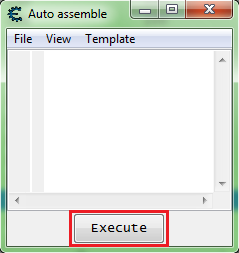
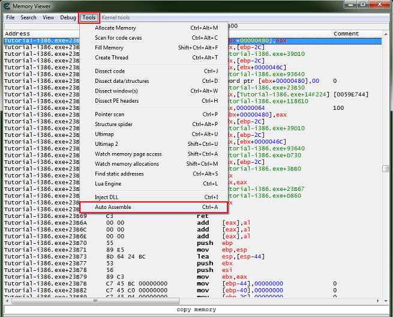
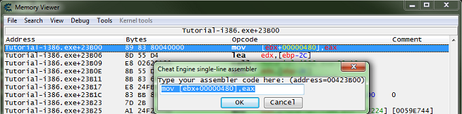
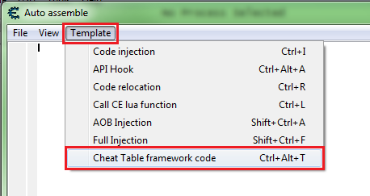
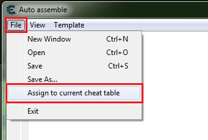
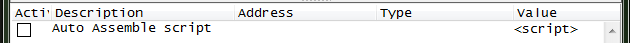

Esse texto explica o **Auto Assembler** do **Cheat Engine** e sua relação com Assembly e o processo de injeção de código em programas. Aqui está um resumo e explicação detalhada:

---

### **1. Introdução ao Assembly e Auto Assembler**
O texto começa explicando a evolução da programação:
- No início, a programação usava **cartões perfurados** e depois evoluiu para **byte codes** (código de máquina).
- Como código de máquina não é legível para humanos, **Assembly** foi criado como uma forma mais compreensível de representar esses códigos.

#### **Exemplo:**
Código de máquina (hexadecimal, difícil de ler):
```
89 83 80 04 00 00 8D 55 D4 E8 02 62 01 00 8B 55 D4 ...
```
O mesmo código em Assembly (muito mais legível):
```assembly
mov [ebx+00000480],eax
lea edx,[ebp-2C]
call 00439D10
mov edx,[ebp-2C]
```
- **Assembly** é apenas uma forma de traduzir código de máquina para algo mais legível.
- O **Cheat Engine** tem seu próprio montador chamado **"Auto Assembler"**, que pode lidar com mais comandos do que apenas instruções de Assembly.
- O **Auto Assembler** também tem uma versão mais básica dentro da "Memory View", chamada simplesmente de **"Assembler"**.

---

### **2. Como Acessar o Auto Assembler no Cheat Engine**
- Atalho: **Ctrl + Alt + A** → Abre o Auto Assembler.
- Dentro da interface do **Auto Assembler**, você pode executar **scripts** pressionando o botão "Executar".

---

### **3. Comandos Básicos do Auto Assembler**
O **Auto Assembler** permite definir variáveis e executar comandos. Aqui estão alguns exemplos:

#### **Definir uma constante:**
```assembly
define(someConstant,1)
```
Isso cria uma constante chamada `someConstant` com o valor `1`.

#### **Executar código em Lua dentro do Auto Assembler:**
```assembly
{$lua}
print('Hello World!')
{$asm}
define(someConstant,1)
```
- O código entre `{$lua} ... {$asm}` permite executar comandos em **Lua** e depois voltar para Assembly.
- `print('Hello World!')` imprime **"Hello World!"** no console do Cheat Engine.

**Observação:**  
- Os comandos do **Auto Assembler** **não são sensíveis a maiúsculas e minúsculas**, então `define` e `DEFINE` funcionam da mesma forma, assim como `mov` e `MOV`.

---

### **4. Usando o Auto Assembler na "Memory View"**
- Para abrir o Auto Assembler pela **Memory View**, use **Ctrl + A**.

- No **Memory View**, você pode **editar** diretamente uma instrução clicando duas vezes sobre ela.

---

### **5. Criando Scripts e Adicionando ao Cheat Table**
Para adicionar um script ao Cheat Table:
1. Abra o **Auto Assembler** (**Ctrl + Alt + A**).
2. Se ainda não tiver uma seção de **Enable/Disable**, clique em **Template → Cheat Table Framework Code**.

3. No menu do Auto Assembler, vá em **File → Assign to current cheat table**.

4. Isso criará um novo **registro de memória** na tabela de cheats.


---

### **6. Estrutura Básica de um Script do Auto Assembler**
```assembly
//// --------------------  Main Section  ---------------------

[ENABLE]
//// --------------------  Enable Section  ---------------------

[DISABLE]
//// --------------------  Disable Section  --------------------
```
- **`[ENABLE]`** → Código que será executado quando o cheat for ativado.
- **`[DISABLE]`** → Código que será executado quando o cheat for desativado.
- O código dentro da **Main Section** é executado tanto no momento de ativação quanto de desativação.

---

## **📌 Resumo**
✅ **Assembly é uma linguagem intermediária entre bytecode e código legível por humanos.**  
✅ **O Cheat Engine usa o Auto Assembler para escrever e injetar códigos em tempo real.**  
✅ **Auto Assembler permite misturar comandos de Assembly com scripts em Lua.**  
✅ **Podemos modificar diretamente o código de um jogo ou criar scripts para cheats automatizados.**  
✅ **Os scripts seguem uma estrutura `[ENABLE]` e `[DISABLE]`, permitindo ativar/desativar hacks facilmente.**  


---


### **Explicação Detalhada sobre Auto Assembler - AOBs**

---

### **1. O que é um AOB?**
AOB (**Array of Bytes**) é uma **sequência de bytes** usada como **assinatura** para localizar um bloco de código na memória. Isso é útil porque **endereços de memória podem mudar** cada vez que um programa ou jogo é executado, mas a assinatura AOB pode ser usada para encontrar o código certo **mesmo se ele mudar de endereço**.

#### **Diferença entre um AOB e uma Assinatura:**
- Um **AOB** é apenas uma sequência fixa de bytes.
- Uma **Assinatura** AOB contém **wildcards (`xx` ou `?`)**, o que permite flexibilidade caso pequenas variações ocorram no código.

---

### **2. Exemplo de Código com AOB**
O texto fornece um exemplo de código do **passo 8** do **tutorial do Cheat Engine (x32)**:

```assembly
Tutorial-i386.exe+26180 - E8 7B85FEFF           - call Tutorial-i386.exe+E700
Tutorial-i386.exe+26185 - 8B 55 DC              - mov edx,[ebp-24]  //// AOB começa aqui
Tutorial-i386.exe+26188 - 89 42 18              - mov [edx+18],eax  //// Aqui será a injeção
Tutorial-i386.exe+2618B - 8B 45 DC              - mov eax,[ebp-24]
Tutorial-i386.exe+2618E - 8B 40 18              - mov eax,[eax+18]
Tutorial-i386.exe+26191 - 8D 55 B0              - lea edx,[ebp-50]
Tutorial-i386.exe+26194 - E8 073C0100           - call Tutorial-i386.exe+39DA0
```

**Explicação:**
- O código armazena valores em `edx` e manipula a memória com `mov` e `lea`.
- O ponto de **injeção** será em `Tutorial-i386.exe+26188`, onde `mov [edx+18],eax` ocorre.
- Em vez de usar diretamente esse endereço, vamos criar uma **assinatura AOB** para garantir que sempre encontraremos esse local.

---

### **3. Criando uma Assinatura AOB**
Podemos criar uma **assinatura baseada em padrões**, para garantir que o código possa ser localizado mesmo que o deslocamento (offset) mude.

**Código original sem wildcards:**
```
89 42 18 8B 45 DC 8B 40 18 8D 55 B0
```

Se quisermos lidar com mudanças de registradores ou deslocamentos, podemos usar wildcards:
```
8Bxxxx89xxxx8Bxxxx8Bxxxx8DxxxxE8xxxxxxxx8Bxxxx8Bxxxx8B
```
**Explicação:**
- **Wildcards (`xx` ou `?`)** são usados para representar valores variáveis que podem mudar de uma execução para outra.
- Aqui, estamos assumindo que a estrutura geral do código sempre conterá **CALL, MOV, MOV, MOV, LEA, CALL**, independentemente dos registradores específicos usados.

---

### **4. Como Usar no Cheat Engine**
1. **Abrir o Cheat Engine** e **fazer um AOB Scan**:
   - Digite a assinatura **`8Bxxxx89xxxx8Bxxxx8Bxxxx8DxxxxE8xxxxxxxx8Bxxxx8Bxxxx8B`** na busca.
   - Pressione **"First Scan"**.
   - Se houver **múltiplos resultados**, adicione mais bytes à assinatura para torná-la única.

---

### **5. Criando um Script no Auto Assembler**
Agora que encontramos o AOB, podemos criar um **script de injeção** para alterar o comportamento do código.

```assembly
define(step8WrtBytes, 89 42 18 8B 45 DC)

//// ------------------------------ ENABLE ------------------------------
[ENABLE]
aobScanModule(aobStep8WrtHook, Tutorial-i386.exe, 8Bxxxx89xxxx8Bxxxx8Bxxxx8DxxxxE8xxxxxxxx8Bxxxx8Bxxxx8Bxxxxxxxxxx)

define(injStep8WrtHook, aobStep8WrtHook+3)
assert(injStep8WrtHook, step8WrtBytes)  // Garante que os bytes são os esperados antes de injetar
registerSymbol(injStep8WrtHook)
alloc(memStep8WrtHook, 0x400, injStep8WrtHook)

// Código injetado
injStep8WrtHook:
    jmp step8wrtn_code
    nop
step8wrtreturn:

//// ------------------------------ DISABLE ------------------------------
[DISABLE]
injStep8WrtHook:
    db step8WrtBytes  // Restaura os bytes originais

unregisterSymbol(injStep8WrtHook)
unregisterSymbol(ptrStep8WrtHook)
dealloc(memStep8WrtHook)
```

**O que esse script faz?**
1. **Procura a assinatura AOB** usando `aobScanModule`.
2. **Garante que os bytes esperados estão no lugar** antes de modificar (`assert`).
3. **Cria um espaço de memória** (`alloc`).
4. **Redireciona a execução** (`jmp`) para código customizado.
5. **Ao desativar**, **restaura os bytes originais** e remove os símbolos da tabela do Cheat Engine.

---

### **6. Usando AOB para Encontrar Ponteiros**
Em alguns casos, podemos usar **AOBs para encontrar ponteiros dinâmicos** em vez de apenas código injetável.

Exemplo de código:
```assembly
Tutorial-i386.exe+25FB1 - A1 60D65F00           - mov eax,[Tutorial-i386.exe+1FD660]
Tutorial-i386.exe+25FB6 - 89 45 E8              - mov [ebp-18],eax
Tutorial-i386.exe+25FB9 - 8B 45 E8              - mov eax,[ebp-18]
Tutorial-i386.exe+25FBC - 8B 55 E8              - mov edx,[ebp-18]
Tutorial-i386.exe+25FBF - 8B 00                 - mov eax,[eax]
Tutorial-i386.exe+25FC1 - 3B 42 04              - cmp eax,[edx+04]
Tutorial-i386.exe+25FC4 - 74 02                 - je Tutorial-i386.exe+25FC8
Tutorial-i386.exe+25FC6 - EB 4F                 - jmp Tutorial-i386.exe+26017
```

Podemos criar um AOB para localizar essa seção de código:
```
A1xxxxxxxx89xxxx8Bxxxx8Bxxxx8Bxx3Bxxxx74xxEBxx8Bxxxx8Bxxxx8Bxxxx3Bxxxx
```
E usá-lo para **encontrar um ponteiro dinâmico**:
```assembly
[ENABLE]
aobScanModule(aobStep8Hook, Tutorial-i386.exe, A1xxxxxxxx89xxxx8Bxxxx8Bxxxx8Bxx3Bxxxx74xxEBxx8Bxxxx8Bxxxx8Bxxxx3Bxxxx)
define(ptrStep8Hook, aobStep8Hook+1)
registerSymbol(ptrStep8Hook)

[DISABLE]
unregisterSymbol(ptrStep8Hook)
```
**Explicação:**
- **Procura um AOB que contenha uma instrução `mov eax,[...]`**, que pode estar carregando um ponteiro.
- **Usamos `define(ptrStep8Hook, aobStep8Hook+1)`** para definir o deslocamento correto do ponteiro.
- **Ao desativar, removemos o ponteiro do Cheat Engine.**

---

### **📌 Resumo**
✅ **AOBs permitem encontrar códigos mesmo que o endereço de memória mude.**  
✅ **Usamos `xx` ou `?` como wildcards para permitir variações nos registradores e offsets.**  
✅ **Podemos injetar código ou encontrar ponteiros dinamicamente com AOBs.**  
✅ **O Cheat Engine facilita essa busca com `aobScanModule()` e `registerSymbol()`.**  
✅ **Sempre garantimos que os bytes corretos estão no lugar antes de modificar (`assert`).**  

Se precisar de mais detalhes ou um exemplo mais prático, me avise! 🚀

