## Engenharia reversa e hacking de memória com Cheat Engine

O que estamos fazendo?

Vamos modificar instruções na memória do programa.

A ideia é que, ao clicar em um botão (HIT ME)  no programa, ao invés de diminuir um valor, ele aumente.

Mas, antes de fazermos essa alteração, precisamos encontrar o endereço onde esse valor está armazenado. 

Primeir passo é ir no modo de treino do *CE*

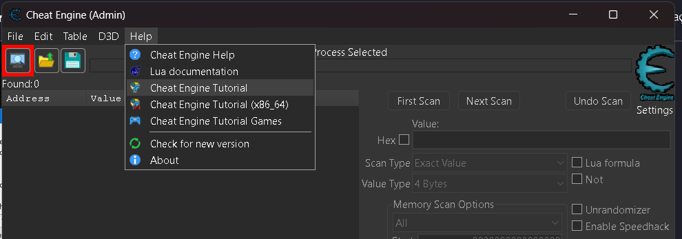

E dar ok ou next até a etapa chegar na 7 ou (Step 7)

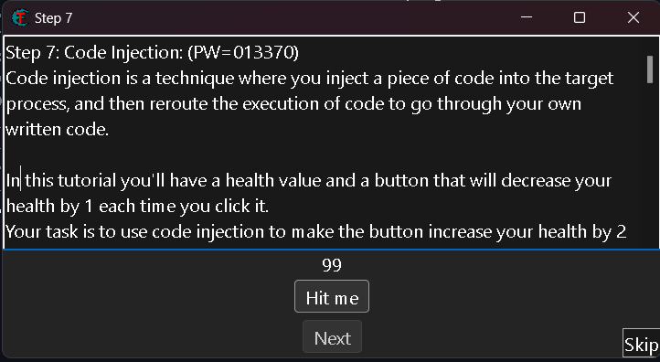
nessa etaá tem o botão que precisaremos modificar o seu evento.

Selecione o processo que iremos trabalhar, que nesse caso é o tutorial.
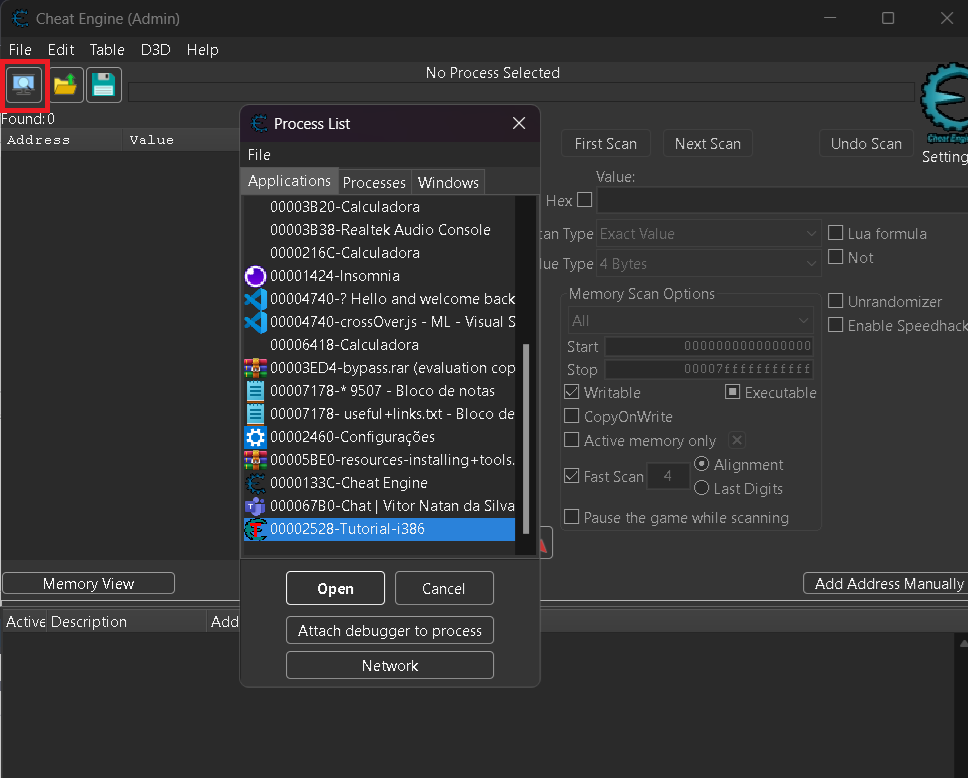

Iremos sacaner o valor, que no meu caso é *99* até achar o endereço de memoria.
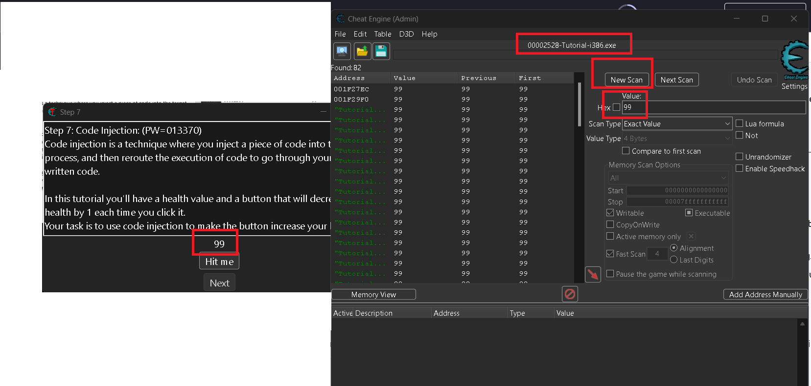

No meu caso o endereço é *0176B600*
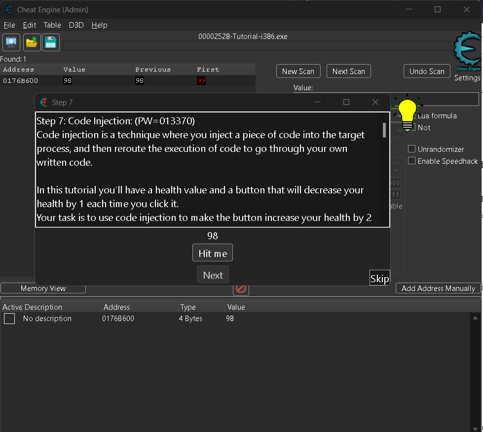

Apos seleciona a memoria precisaremos ir para o modo de depuração/debugger do CE

**(Find out what accesses this address F5)**
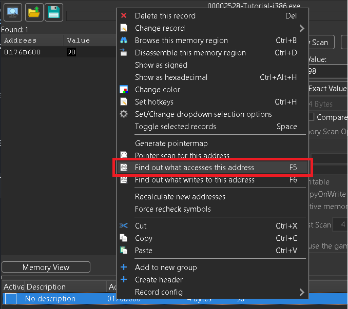

Ao clicar em (HIT ME) irá aprensetar o evento em tela sobre o endereço que estamos observado, que no meu caso *0176B600*
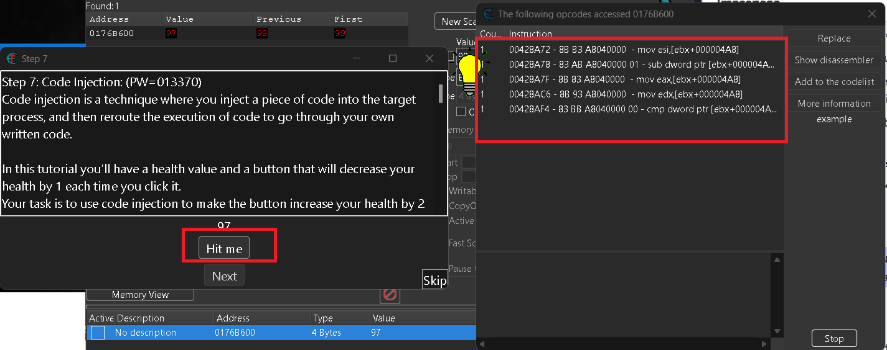

Conforme a instruction teremos as inforamções na lateral de
**Copy memory** como **leitura/reading** e **subtract** como **escrita/writing**

Com a instrução selecionada iremos usar o "show disassembler";
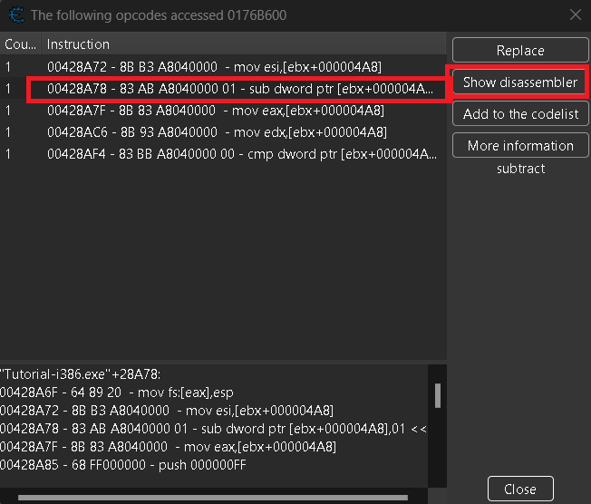 

Ira mostrar a tela de Memory Viewer
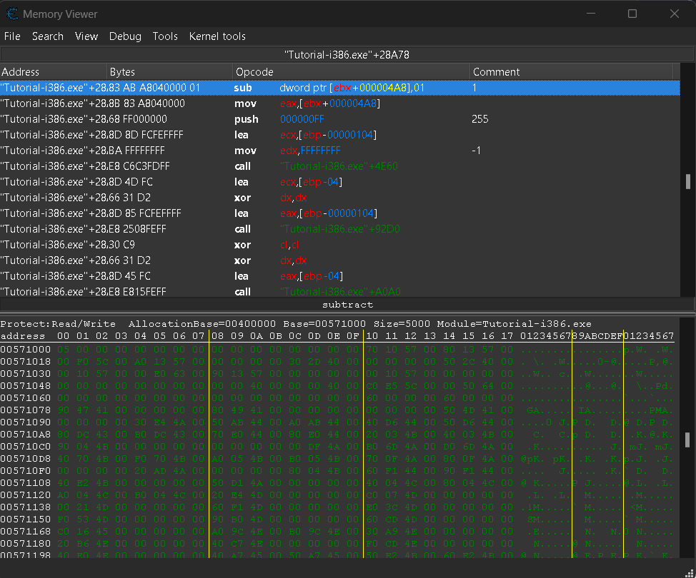

Vamos analisar essa instrução de **Assembly** passo a passo:

### **Instrução:**  
```assembly
"Tutorial-i386.exe"+28A78 - sub dword ptr [ebx+000004A8],01
```

### **Quebrando a instrução**
1. **"Tutorial-i386.exe"+28A78**  
   - Esse endereço refere-se a um deslocamento (`offset`) dentro do **executável** `Tutorial-i386.exe`.  
   - O `28A78` é um deslocamento dentro da memória onde esse código está sendo executado.  

2. **`sub dword ptr [ebx+000004A8],01`**  
   - **`sub`** → Subtrai um valor do operando especificado.  
   - **`dword ptr [ebx+000004A8]`** → Refere-se a um valor de **4 bytes (DWORD)** armazenado na memória no endereço `[ebx + 4A8]`.  
   - **`01`** → Subtrai `1` desse valor.

### **O que essa linha faz?**
Ela diminui em **1** o valor armazenado na memória, no endereço **`[ebx+4A8]`**.

### **Provável Uso no Programa**
- **`ebx`** no nosso caso da um **Hit me** no ''jogo/programa''.
- **`[ebx+4A8]`** representa uma variável numérica, como para os Pontos de vida (HP).

Se esse código estiver relacionado a um jogo, essa linha pode representar, por exemplo:
- **Diminuição da vida do jogador ou inimigo** ao ser atingido.
- **Gasto de um recurso**, como munição ou dinheiro.
- **Redução de um temporizador.**

---

### **Como Explorar essa Instrução?**
Se quisermos modificar ou manipular esse comportamento, podemos:
1. **Interceptar essa linha com um script em Cheat Engine** e impedir a redução (`NOP` a instrução).  
2. **Modificar o valor diretamente** para um número fixo (ex.: saúde infinita).  
3. **Alterar o código para inverter o efeito** (ex.: somar em vez de subtrair).  
   - **Exemplo de modificação:**  
     ```assembly
     add dword ptr [ebx+000004A8],01  ; Agora aumentará em vez de diminuir.
     ```
---

### **Resumo**
Essa linha subtrai **1** do valor armazenado em `[ebx+4A8]`, que pode ser qualquer variável no programa (vida, dinheiro, tempo, etc.). Se quisermos explorar isso, podemos manipulá-la para impedir a redução ou até inverter seu efeito.
---

Com o endereço/Address selecionado iremos no menu e clicar em **Tools** e procurar por **Auto Assembler**
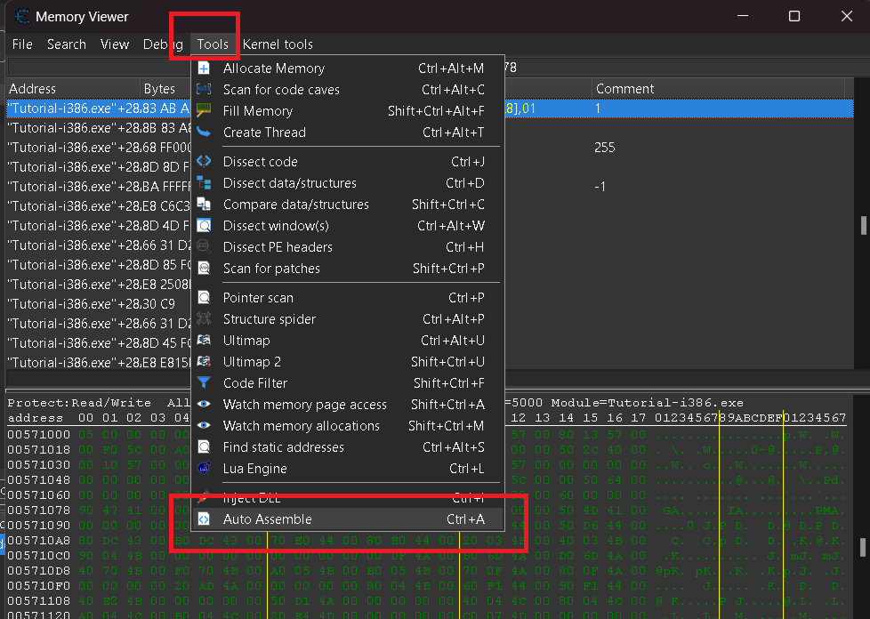

Agora ira abrir uma nova janela chamda **Auto Assembler** e iremos no menu dessa janela em  **Template** e **AOB Injection** 
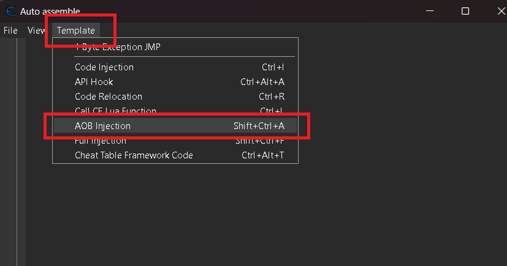

OBS: **Assembly** é uma linguagem intermediária entre bytecode e código legível por humanos.
**AOB** (**Array of Bytes**) é uma **sequência de bytes** usada como **assinatura** para localizar um bloco de código na memória. Isso é útil porque **endereços de memória podem mudar** cada vez que um programa ou jogo é executado, mas a assinatura AOB pode ser usada para encontrar o código certo **mesmo se ele mudar de endereço**

Proximmo passo é é entrar no **Modelo de injeção ou Code injection template** que ira pergunta:

Em qual endereço você quer o salto?
```assembly
"Tutorial-i386.exe"+28A78
```
Iremos com *ok*
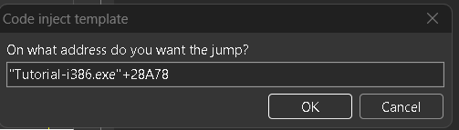

Depois teremos um nova janela pergunto sobre

**Modelo de injeção de código**

**Qual nome você quer dar ao símbolo para o ponto de injeção?**

iremos com:
```
INJEC
```
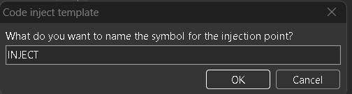
Assim que o comando que irá injetar o nosos cocigo for ativado ficar com o Endereço como texto **INJEC**

### **Explicação do Código do Auto Assembler no Cheat Engine**

Esse código é um **script de injeção de código (Code Injection)** usado no **Cheat Engine**. Ele modifica o comportamento do programa **"Tutorial-i386.exe"**, especificamente alterando a instrução que decrementa um valor na memória.

## Em sequidar irá criar um script como templte

# **Estrutura Geral do Script**
O script está dividido em **seções**:

1. **Cabeçalho** (comentários explicativos)
2. **[ENABLE]** – Código que será ativado ao habilitar o script.
3. **[DISABLE]** – Código que será restaurado quando o script for desativado.
4. **Comentários** – Explicam onde o código está sendo injetado.

---

## **🔹 Cabeçalho**
```assembly
{ Game   : Tutorial-i386.exe
  Version: 
  Date   : 2025-03-07
  Author : User

  This script does blah blah blah
}
```
- Apenas **comentários** que documentam o script.  
- `{}` é usado para criar blocos de comentário no Cheat Engine.  
- Aqui, o autor não preencheu os detalhes sobre a versão e funcionalidade específica.

---

## **🔹 Seção [ENABLE] (Ativar o Cheat)**
Esta parte **injeta o código modificado** na memória do jogo.

### **1. Procurando um Padrão de Bytes com `aobscanmodule`**
```assembly
aobscanmodule(INJECT,Tutorial-i386.exe,83 AB A8 04 00 00 01) // should be unique
```
- **`aobscanmodule`** busca um **Array of Bytes (AOB)** dentro do módulo `Tutorial-i386.exe`.
- A assinatura **`83 AB A8 04 00 00 01`** representa a instrução `sub dword ptr [ebx+000004A8],01`, que **subtrai 1 de um valor armazenado na memória**.
- Isso garante que o código será injetado **no local correto**, mesmo que o endereço mude entre execuções.

---

### **2. Criando Memória para o Código Modificado**
```assembly
alloc(newmem,$1000)
```
- **`alloc(newmem,$1000)`** → Aloca **4 KB (0x1000 bytes)** de memória para armazenar o novo código.
- **`newmem`** será o nome do bloco de memória.

---

### **3. Criando Rótulos (Labels)**
```assembly
label(code)
label(return)
```
- Define **marcadores (labels)** chamados `code` e `return` para organizar o fluxo do script.

---

### **4. Criando o Código Modificado**
```assembly
newmem:

code:
  sub dword ptr [ebx+000004A8],01
  jmp return
```
- `sub dword ptr [ebx+000004A8],01` → **Mantém a instrução original** que diminui o valor em `[ebx+4A8]` por 1.
- `jmp return` → Após a modificação, **redireciona a execução de volta ao código original**, evitando falhas.

#### Agora iremos modificar o evento para aumentaer em 2:

Em `newmem`, modificamos a lógica para somar 2 ao invés de subtrair 1.
```assembly
newmem:
  add dword ptr [ebx+000004A8],02
code:
  //sub dword ptr [ebx+000004A8],01
  jmp return
```
*Assim atingimos objetivo do desafio*
---

### **5. Redirecionando o Código Original**
```assembly
INJECT:
  jmp newmem
  nop 2
return:
```
- `jmp newmem` → **Redireciona** o código original para executar `newmem`, onde o código modificado será executado.
- `nop 2` → Insere **NOPs (No Operation)** para preencher os bytes restantes, garantindo que o jogo não quebre.

---

### **6. Registrando o Símbolo**
```assembly
registersymbol(INJECT)
```
- **`registersymbol(INJECT)`** → Registra o endereço `INJECT` para que possa ser usado em outras partes do Cheat Engine.

---

## **🔹 Seção [DISABLE] (Desativar o Cheat)**
Quando o cheat é **desativado**, o código original é restaurado.

### **1. Restaurando a Instrução Original**
```assembly
INJECT:
  db 83 AB A8 04 00 00 01
```
- **`db` (Define/Declare Bytes)** → Reescreve manualmente os bytes da instrução original `sub dword ptr [ebx+000004A8],01`, restaurando o funcionamento normal.

---

### **2. Limpando a Memória e Símbolos**
```assembly
unregistersymbol(INJECT)
dealloc(newmem)
```
- **`unregistersymbol(INJECT)`** → Remove `INJECT` da lista de símbolos do Cheat Engine.
- **`dealloc(newmem)`** → Libera a memória alocada anteriormente para evitar desperdício de recursos.

---

## **🔹 Trecho do Código Original do Jogo**
Abaixo do script, há um trecho do código original do jogo com a área de injeção destacada:
```assembly
"Tutorial-i386.exe"+28A78: 83 AB A8 04 00 00 01  - sub dword ptr [ebx+000004A8],01  // INJECTING HERE
```
Isso mostra exatamente **onde** a injeção ocorre no código do jogo.

---

## **📌 Resumo**
🔹 **Esse script injeta código no jogo "Tutorial-i386.exe" e modifica a instrução `sub dword ptr [ebx+000004A8],01`**.  
🔹 **AOB Scan** é usado para encontrar a instrução correta na memória, garantindo que o script funcione mesmo que os endereços mudem.  
🔹 **Ao ativar, o script desvia a execução para o código modificado, mantendo o comportamento original.**  
🔹 **Ao desativar, ele restaura os bytes originais e limpa a memória.**  


###  Quando terminar de fazer a alterção iremos criar a nossa tabela em 
*Fiel -> + Assign to current cheat table*
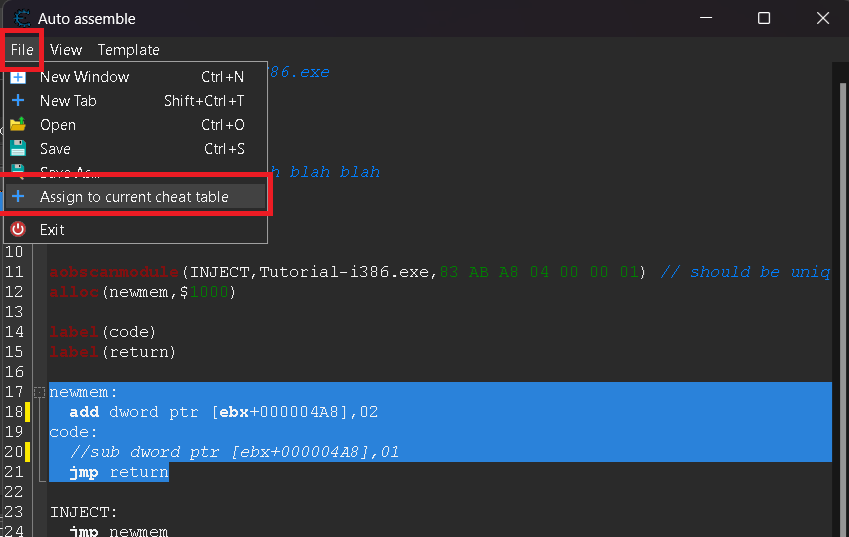

A fazer isso podemos fechar e voltar para tela principal do Cheat Engien;
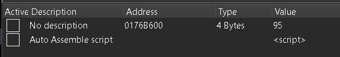

Tendo agora duas intruções a primeira do scan e a seungo com o script recem criado.

Dando dos click em `<script>` na colunas Value podemos visualisar o codigo e alterar novamente.
Agora quando marco a caixa para injetar o meu codigo iremos ver a alteração em *Memory Viewer*
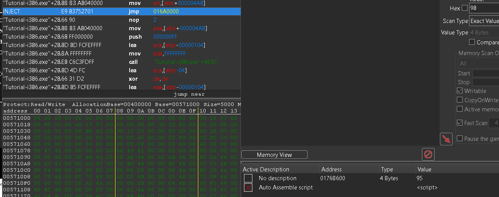

Ao selecionar Endereço/Address em *Memory Viewer* e buscar por *Follow*
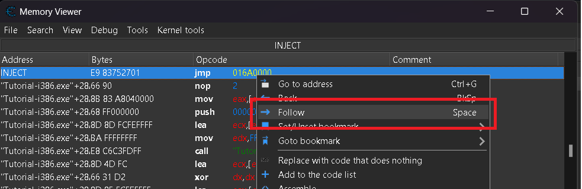

Poderemos ver o codigo *add* que aumento implementado na memoria
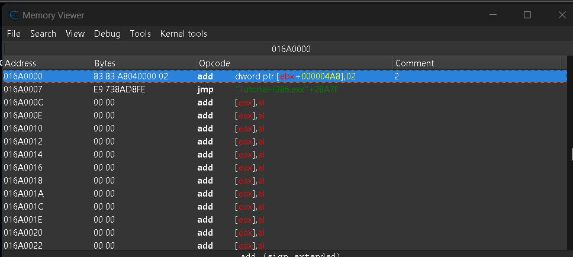

E assim au dismarcar a caixa poderemos contrar o evento de adicionar e remover.

OBS: Caso tenh perdido o local do endereço por algum motivo vc pode procurar usando a funcionalidade *Go to address* 

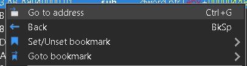

E procurar o dessa forma:

