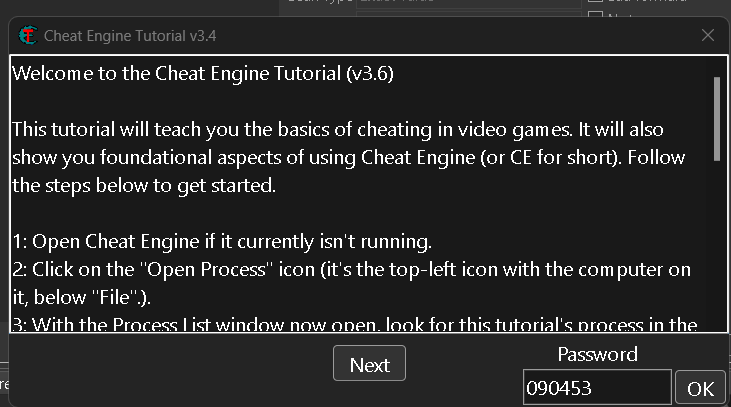

# O que é um [CrackMe](https://crackmes.one/)?  

Um **CrackMe** é um pequeno programa criado para testar habilidades de engenharia reversa.  

Esses programas são desenvolvidos por especialistas como uma forma legal e educativa de praticar **cracking**, sem infringir propriedade intelectual.  

## *Cheat Engine* e suas ferramentas para manipulação de memória  

  

O *Cheat Engine* possui diversas ferramentas que permitem testar e manipular a memória do sistema.  

Com essa ferramenta, podemos validar conceitos e realizar testes de maneira simples, seguindo um tutorial prático.  
